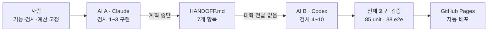

<div align="center">

<p><code>SKT FLY AI · T05</code></p>

# 대화가 끊겨도 이어지는 프로젝트

### Claude가 멈춘 자리에서 Codex가 대화 없이 완성한 AI 인계 실험

완성된 T03 카드 스튜디오에 **원본 ↔ 카드 비교 슬라이더**를 추가하며,<br>
AI A와 AI B 사이의 대화 대신 코드·검사·`HANDOFF.md`만 전달했습니다.

<br>

**[서비스 바로가기](https://myeongjundev.github.io/t05-ai-handoff/)** ·
**[30초 검증 안내](docs/T05-VERIFICATION.md)** ·
**[최종 비교 결과](docs/FINAL_COMPARISON.md)** ·
**[배포 검증 JSON](https://myeongjundev.github.io/t05-ai-handoff/handoff-verification.json)**

[](https://github.com/myeongjundev/t05-ai-handoff/actions/workflows/deploy.yml)


<br>


</div>

## 이 실험이 묻는 것

> 첫 번째 AI의 대화를 전달하지 않아도, 다음 AI가 문서만 읽고 같은 프로젝트를
> 안전하게 이어갈 수 있을까?

단순히 두 모델 중 누가 빠른지를 겨루지 않았습니다. 기능 범위와 검사 10개를 먼저
고정하고, Claude가 계획된 시점에 멈춘 뒤 Codex가 **사람의 추가 설명 없이** 나머지를
완성하는지를 확인했습니다.

성공 기준은 명확했습니다.

- AI A는 맡은 검사까지만 구현하고 계획대로 멈춘다.
- 인계 문서는 다음 행동과 금지 영역을 스스로 설명한다.
- AI B는 첫 대화 없이 남은 검사와 전체 회귀 검사를 완료한다.
- 사람이 코드를 다시 고치거나 같은 내용을 재설명하지 않는다.
- 실행하지 않은 검사는 통과했다고 기록하지 않는다.

## 결과 한눈에 보기

| 구분 | AI A · Claude Opus 5 | 인계 | AI B · Codex |
|---|---:|---|---:|
| 역할 | 첫 수직 구현 | 실행 가능한 상태 전달 | 완성·회귀 검증 |
| 공식 작업시간 | 11분 | — | 8분 |
| 사용자 요청 | 3회 | 추가 설명 0회 | 1회 |
| 담당 검사 | 1~3 | 통과·미실행 구분 | 4~10 + 전체 재검사 |
| 남긴 오류 | 0개 | 문서 수정 0회 | 0개 |
| 사람 재작업 | 0개 | — | 0개 |
| 종료 조건 | 계획 중단 | 7개 항목 전달 | **10/10 통과** |

`3 대 7`은 속도 점수가 아니라 처음부터 나눈 역할입니다. AI A의 11분에는 기준선
확인과 인계 작성이 포함되고, AI B의 8분에는 전체 회귀 검사가 포함됩니다.

또한 `11분 + 8분`은 **공식 AI 실행 구간만 잰 값**입니다. 과제 선정, 실험 설계,
고정 검사 작성, 결과 해석, 공개 화면 보강과 제출 정리는 포함하지 않습니다.

## 대화 대신 무엇을 전달했나



`HANDOFF.md`는 회고문이 아니라 다음 AI가 바로 실행할 수 있는 문서로 만들었습니다.

| # | 인계 항목 | 전달한 핵심 |
|---:|---|---|
| 1 | 목표 | 비교 슬라이더와 남은 고정 검사 |
| 2 | 현재 상태 | 커밋·변경 파일·구조적 판단 |
| 3 | 실행 명령 | 설치·테스트·빌드·개발 서버 |
| 4 | 통과한 검사 | 통과 1~3, 미실행 4~10을 명확히 분리 |
| 5 | 남은 문제 | 키보드·빈 사진 안내·회귀 위험 |
| 6 | 다음 행동 | 권장 구현 순서와 재검사 방법 |
| 7 | 주의 사항 | 편집 상태·PNG·이력에서 지켜야 할 경계 |

특히 “건드리면 안 되는 부분”이 중요했습니다. 비교 모드를 편집 상태에 넣지 않고,
원본을 캔버스에 다시 그리지 않으며, 템플릿·공유 링크·되돌리기 이력에 섞지 않는다는
경계를 고정했습니다.

## 개선 기능 · 원본 ↔ 카드 비교 슬라이더

완성 카드와 원본을 같은 프레임에서 즉시 비교합니다.

1. Studio에서 사진을 고릅니다.
2. 결과 확인의 `보기` 메뉴에서 `원본과 비교`를 누릅니다.
3. 경계선을 끌거나 방향키·Home·End로 0~100을 움직입니다.


Studio는 편집과 결과에 집중하는 2열 구조입니다. 템플릿은 왼쪽 편집기 아래에
접어 두고, 보기·공유·다운로드는 미리보기 위 한 줄에 모아 기능을 줄이지 않고
시선 이동과 반복 안내를 줄였습니다.

비교 상태는 `PreviewPanel` 내부에만 존재합니다. 원본 ``를 완성 캔버스 위에
겹치고 `clip-path`로 자르기 때문에, 비교를 켜도 실제 PNG 픽셀은 바뀌지 않습니다.

```text
완성 카드 canvas   ───────────────┐
원본 image overlay ─ clip-path ──┼─ 화면에서만 비교
비교 UI state      ─ local state ┘

editorState · template · share link · history · PNG에는 들어가지 않음
```

## 실험 뒤에도 이어진 제품 판단

기능 완성 뒤에도 “정보가 많다”는 문제를 남겨 두지 않았습니다. Claude가 현재 구조와
Canvas-first·Single-column 목업을 만들고, Codex가 결과 확인 거리가 짧은 Option A를
구현해 회귀 검증했습니다.

| 측정 항목 | 정리 전 | Canvas-first 이후 |
|---|---:|---:|
| 주요 시각 구역 | 23 | 약 14 |
| 반복 안내 | 8 | 3 |
| 미리보기 조작 줄 | 3 | 1 |
| Studio 열 | 3 | 2 |

- 템플릿을 삭제하지 않고 편집기 하단 접이식 묶음으로 이동했습니다.
- 보기·공유·다운로드를 한 툴바로 모으고 저빈도 기능만 메뉴에 넣었습니다.
- 캔버스 렌더와 PNG는 바꾸지 않고 CSS 표시 면적만 넓혔습니다.
- 390px에서는 미리보기를 먼저 보여 주며 가로 overflow가 없음을 다시 검사했습니다.

공개 화면의 `06 / POST-EXPERIMENT PRODUCT DECISION`에서 Before/After 구조와 선택
이유를 직접 볼 수 있습니다. 구현 뒤에도 단위 85/85와 Chromium E2E 38/38을
유지했습니다.

## 고정 검사 10개

기능을 만들기 전에 성공·오류·회귀 검사를 고정했습니다.

| # | 담당 | 검사 | 근거 | 결과 |
|---:|---|---|---|:---:|
| 1 | AI A | 사진이 있으면 비교 모드를 열고 닫는다 | 단위 + 실제 화면 | ✅ |
| 2 | AI A | 경계선과 원본·카드 비율이 함께 바뀐다 | 단위 + 실제 화면 | ✅ |
| 3 | AI A | 0·50·100이 완성만·반반·원본만이 된다 | 단위 + 실제 화면 | ✅ |
| 4 | AI B | 시대·모습 변경 시 카드만 갱신된다 | Chromium e2e | ✅ |
| 5 | AI B | 사진이 없으면 비활성 이유가 보인다 | Chromium e2e | ✅ |
| 6 | AI B | 방향키·Home·End로 조작할 수 있다 | 단위 + e2e | ✅ |
| 7 | AI B | 프레임 밖으로 끌어도 0~100에 고정된다 | Chromium e2e | ✅ |
| 8 | AI B | 비교 뒤에도 PNG 바이트가 같다 | Chromium e2e | ✅ |
| 9 | AI B | 되돌리기·다시하기가 유지된다 | Chromium e2e | ✅ |
| 10 | AI B | 템플릿에 비교 상태가 섞이지 않는다 | Chromium e2e | ✅ |

최종 검증은 T05 검사만 골라 돌리지 않았습니다. 기존 카드 스튜디오의 픽셀 동일성,
접근성, 스크롤 서사, 대비, 모바일 레이아웃까지 함께 재실행했습니다.

| 검사 묶음 | 개수 | 지키는 것 |
|---|---:|---|
| 단위 테스트 | 85 | 상태·렌더·스키마·이력의 순수 규칙 |
| `pixels.e2e.js` | 12 | 미리보기와 PNG 픽셀, 시대별 렌더 |
| `interaction.e2e.js` | 10 | 키보드·스크롤·실제 편집 동작 |
| `contrast.e2e.js` | 8 | 모든 상태의 글자·경계·포커스 대비 |
| `compare.e2e.js` | 8 | T05 검사 4~10과 공개 인계 결과 |

## 실험에서 얻은 운영 기준

1. **작고 고립된 UI**<br>
   Claude로 빠른 수직 구현을 시작하고, 저장·공유·이력 경계를 넘으면 Codex의 회귀
   검증으로 전환합니다.

2. **영향 범위가 넓은 기능**<br>
   Codex로 자동 검사를 먼저 고정하고, 화면 언어와 서사가 약하면 Claude 검토를
   붙입니다.

3. **AI를 바꾸는 순간**<br>
   HANDOFF와 받는 AI용 시작 지시서를 함께 만듭니다. 사람이 같은 내용을 다시
   설명해야 한다면 성공으로 포장하지 않고 인계 실패 또는 문서 보완으로 기록합니다.

## 잘된 일만 기록하지 않았습니다

AI B는 인계 완료 여부를 확인하는 명령에서 금지 규칙을 읽기 전에 `AI-A-LOG.md`를
함께 출력했습니다. 구현 오류는 아니지만, “인계 문서만 읽고 이어갈 수 있는가”라는
실험 절차를 어긴 사건입니다.

이 사실을 삭제하거나 통과 결과로 덮지 않고 [AI B 작업 기록](docs/AI-B-LOG.md)과
공개 화면에 남겼습니다. 다음 실험에서는 HANDOFF뿐 아니라 **받는 AI 전용 시작
지시서**를 먼저 제공한다는 개선 기준도 여기서 나왔습니다.

## AI 활용 3줄

- **AI에게 맡긴 일** — 기능 구현, 자동 검사, 인계 문서 구조화와 원격 동기화.
- **내가 판단한 일** — 비교 기능 선택, Claude→Codex 순서, 중단 시점과 제출 기준.
- **AI 말을 안 들은 일** — 검사 통과만으로 끝내지 않고, 과정과 판단이 보이도록
  인계 사례 연구와 30초 검증 동선을 한 단계 더 보강했습니다.

## 30초 안에 확인하기

공개 화면 아래의 `30초 검증 시작`을 누르거나 [검증 안내서](docs/T05-VERIFICATION.md)를
따릅니다.

저장소에서는 한 명령으로 필수 자료, 보호 문서와 분할 커밋을 먼저 확인할 수 있습니다.

```powershell
npm.cmd run verify:handoff:evidence
```

평가 동선은 **Claude 요청 → HANDOFF → Codex 완성 커밋 → 자동 검증 결과** 순서입니다.

```text
샘플로 30초 체험 → 보기 · 원본과 비교 → 경계선 드래그 또는 방향키
```

기대 결과:

- 왼쪽 원본과 오른쪽 완성 카드의 비율이 함께 바뀝니다.
- Home은 0, End는 100으로 이동합니다.
- 비교를 닫아도 PNG·템플릿·되돌리기 결과는 바뀌지 않습니다.
- 페이지 아래에서 AI A → HANDOFF → AI B와 검사 10개 결과를 확인할 수 있습니다.

## 로컬 실행과 검증

```bash
npm install
npm run dev
```

Windows PowerShell에서는 실행 정책에 따라 `npm.cmd`를 사용합니다.

```powershell
npm.cmd install
npm.cmd run verify:handoff
```

`verify:handoff`는 인계 증거 검사 뒤 단위 85개, 빌드, Chromium E2E 38개를
차례로 실행하며 개수가 하나라도 달라지면 실패합니다. 개별 명령도 그대로 유지됩니다.

e2e를 처음 실행할 때는 Chromium 설치가 한 번 필요합니다.

```powershell
npx.cmd playwright install chromium
```

GitHub Actions는 `main`에 푸시할 때 같은 테스트·빌드·Pages 배포를 자동 실행합니다.

## 저장소 구조

```text
src/
  components/
    PreviewPanel.jsx          비교 UI와 원본 overlay
    HandoffExperiment.jsx     공개 인계 사례 연구와 30초 검증
  state/
    compareMode.js            비교 상태·비율·키보드 계산
  render/                     Canvas 카드 렌더러
  templates/                  템플릿 검증과 localStorage
  io/                         PNG·공유 링크·템플릿 파일
test/
  compareMode.test.js         비교 상태 단위 검사 15건
  e2e/
    compare.e2e.js            T05 실제 브라우저 검사 8건
docs/
  EXPERIMENT_PLAN.md          수정하지 않은 사전 기준
  HANDOFF.md                  AI A → AI B 인계 정본
  FINAL_COMPARISON.md         실측 결과와 운영 기준
  T05-VERIFICATION.md         평가자용 30초 안내
```

## 문서 지도

### T05 핵심 문서

- [과제 원문](docs/T05-ASSIGNMENT.md)
- [사전 실험 계획](docs/EXPERIMENT_PLAN.md)
- [Claude 공식 요청 1](CLAUDE_REQUEST_1.md)
- [Claude 시작·중단 규칙](docs/START-CLAUDE.md)
- [AI A 작업 기록](docs/AI-A-LOG.md)
- [AI A → AI B 인계 문서](docs/HANDOFF.md)
- [AI B 작업 기록](docs/AI-B-LOG.md)
- [최종 비교와 운영 기준](docs/FINAL_COMPARISON.md)
- [Claude 작업 재료 색인](docs/CLAUDE-MATERIALS.md)
- [30초 검증 안내서](docs/T05-VERIFICATION.md)

<details>
<summary><strong>기반 프로젝트 T03 · ALTER / EGO 보기</strong></summary>

### 같은 사진. 다른 시대. 다른 나.

한 장의 사진을 2004 · 2012 · 2026의 인터넷 문법으로 다시 기록하는 local-first
인터랙티브 카드 스튜디오입니다.

<br>

<table>
<tr>
<td width="33%"></td>
<td width="33%"></td>
<td width="33%"></td>
</tr>
</table>

- 2004 미니홈피 · 2012 필름 · 2026 숏폼 시대 렌더
- 기본 · 소셜 · 친한 친구 Persona와 27개 조합
- 1:1 · 4:5 · 9:16 PNG 저장
- 템플릿·공유 링크·되돌리기·게시 전 대비 검사
- 선택한 사진은 서버로 보내지 않는 local-first 구조

T03 상세 자료는 [구현 설계](docs/ARCHITECTURE.md),
[포트폴리오 사례](docs/PORTFOLIO-CASE-STUDY.md),
[자체 점검](docs/SELF-CHECK.md)에서 확인할 수 있습니다.

</details>

## 이미지와 개인정보

- 화면 사진은 생성형 AI로 직접 만든 비실존 인물 이미지입니다.
- 검사 이미지는 `scripts/make-test-images.mjs`로 직접 생성했습니다.
- 앱에서 고른 사진은 서버로 전송하지 않고 현재 브라우저 안에서만 처리합니다.
- 문서와 배포 이미지에서 EXIF·GPS 위치정보 0건을 확인했습니다.

---

<div align="center">

**좋은 인계 문서는 이전 작업을 설명하는 문서가 아니라,<br>다음 작업을 시작시키는 인터페이스입니다.**

</div>
